<div align="center">
  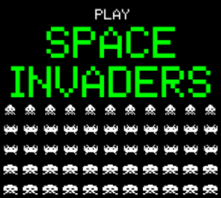
  <h3>A faithful recreation of the 1978 Taito arcade classic</h3>
</div>

## 👾 Quickstart

```bash
git clone https://github.com/martianmr/spaceinvaders
pip install pygame
python invaders.py
```

## 👾 Screenshots

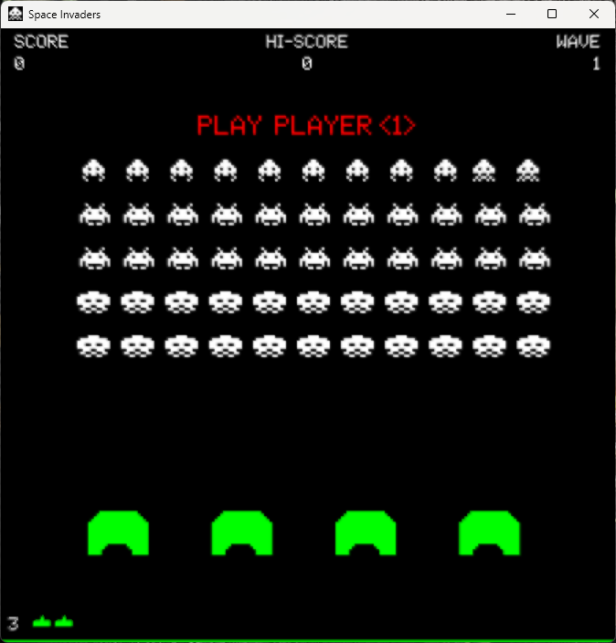
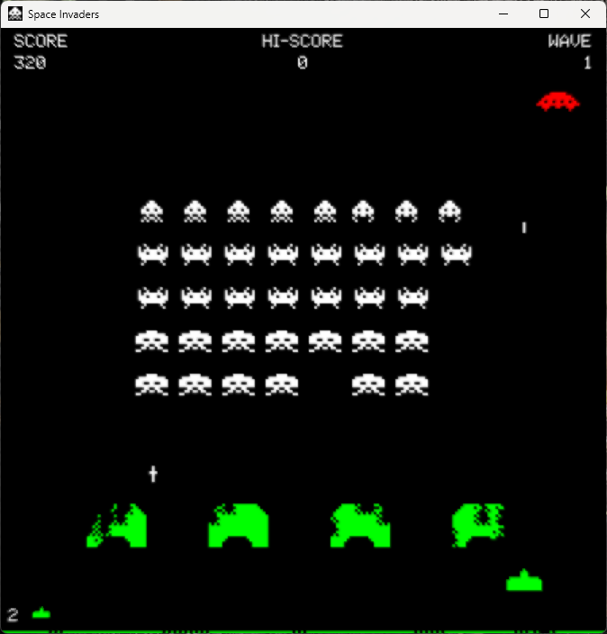
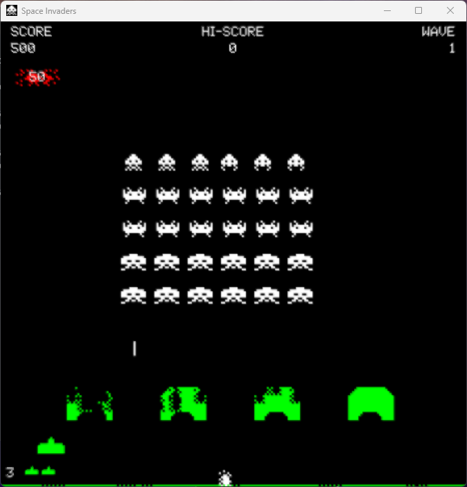
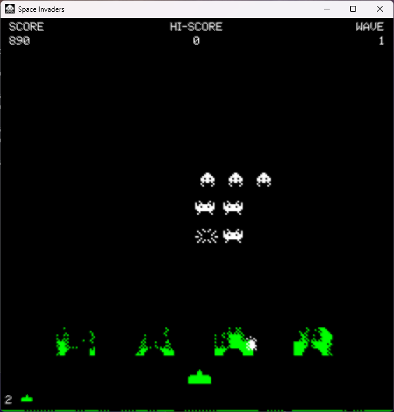
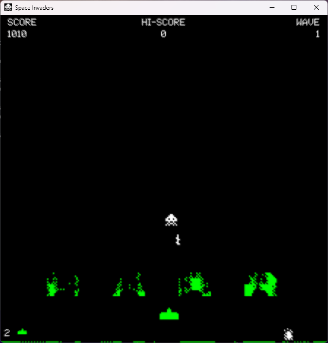
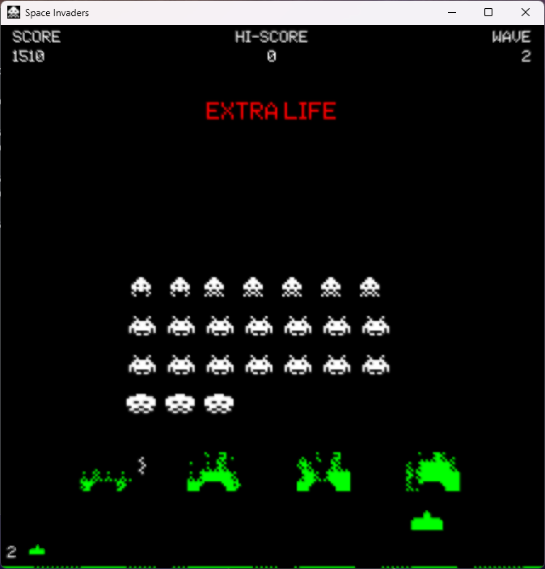
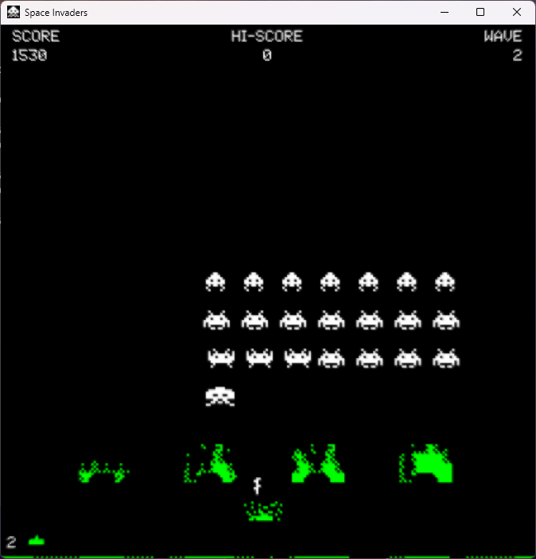
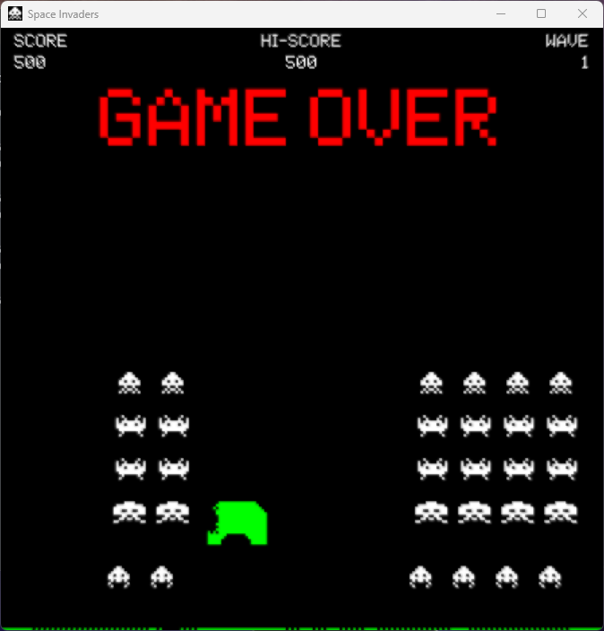
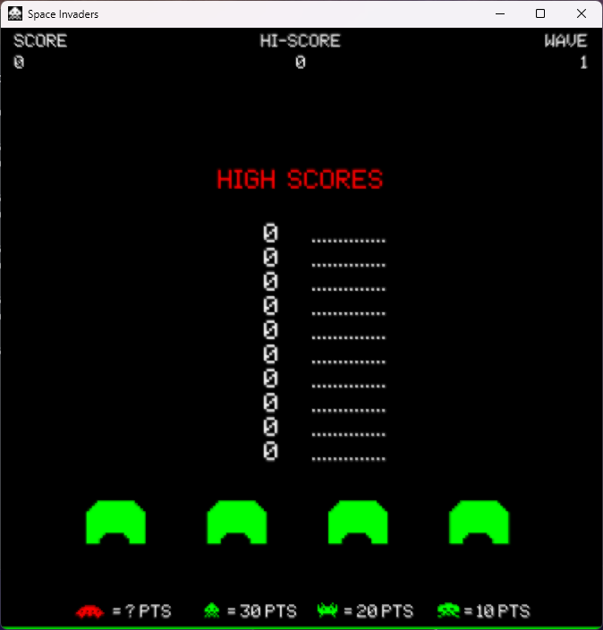
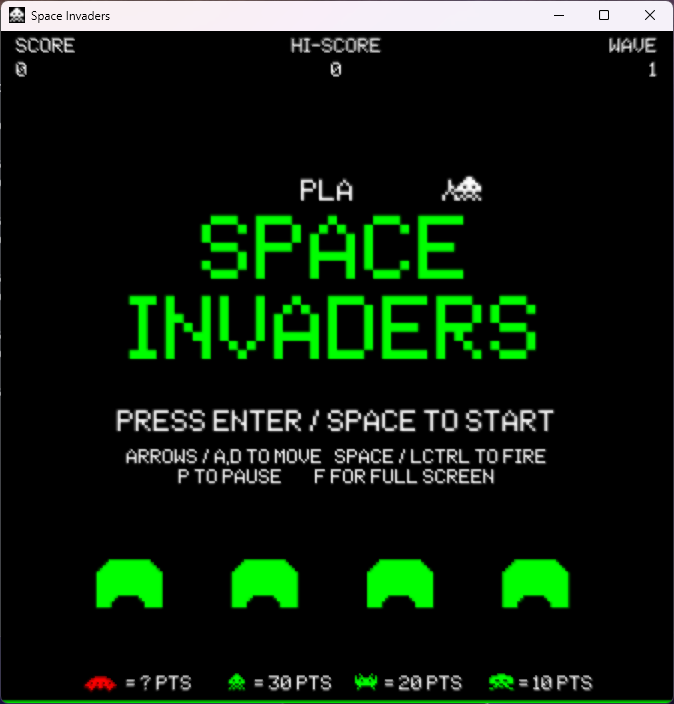

## 👾 License

spaceinvaders is is released under the [MIT license](https://opensource.org/license/mit).
